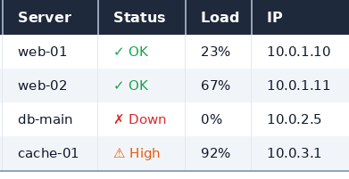

# Hermes MAX Gateway

**Плагин-шлюз для подключения Hermes Agent к мессенджеру MAX.**  
Голосовая транскрипция (STT), интерактивные кнопки (выбор модели, подтверждение команд), отрисовка таблиц в PNG-картинки с цветными иконками, стриминг ответов, загрузка файлов, контроль доступа.

[](LICENSE)
[](https://hermes-agent.nousresearch.com/docs)

---

## Возможности

| Функция | Описание |
|---------|----------|
| 🟣 **MAX Messenger** | Полная интеграция шлюза с max.ru |
| 📡 **Два режима** | Long polling (`GET /updates`) + Webhook (`POST /max/webhook`) |
| 🎤 **STT Голос** | Автозагрузка голосовых сообщений → faster-whisper транскрипция |
| 🖼️ **Таблицы-картинки** | Отрисовка markdown-таблиц в PNG с цветными иконками статусов |
| 📝 **Стриминг** | `edit_message` через `PUT /messages` для вывода токенов в реальном времени |
| 🔘 **Интерактивные кнопки** | callback + link + message + request_contact/geo + модель/approval/clarify |
| 🔗 **Link-кнопки** | Кнопки-ссылки в сообщениях (`send_buttons()` с типом `link`) |
| 👁️ **send_action** | Расширенные статусы: typing, sending_photo/video/audio/file, read, typing_off |
| ✂️ **Авточанкование** | Умная разбивка длинных сообщений (до 4000 символов с сохранением абзацев) |
| ⬆️ **Загрузка файлов** | Двухшаговая загрузка: `POST /uploads` → PUT → токен → отправка |
| 🔒 **Контроль доступа** | Белый список пользователей, групповые политики, проверка секрета вебхука |
| 📎 **Медиа** | Рекурсивное извлечение вложений, кэш изображений/документов/аудио |
| 🎞️ **Голосовые/Видео/Документы** | Отдельные методы `send_voice`, `send_video`, `send_document` |
| ⚡ **Индикатор ввода** | Отображение набора текста для всех типов чатов |
| 🔧 **Standalone-отправитель** | Отправка сообщений из cron/send_message через `_send_max_message` |
| 🌐 **Кросс-платформенные сессии** | `/sessions` показывает сессии со ВСЕХ платформ (CLI, Telegram, Discord, WebUI), `/resume <id>` переключается на любую. Включено по умолчанию (`MAX_CROSS_SESSION=true`) |
| 🧪 **Тесты** | pytest + pytest-asyncio, **94 теста** |
| 🔧 **Интерактивная настройка** | `hermes gateway setup` с подсказками |

## Пример: таблицы-картинки в деле

**Без** `MAX_TABLE_AS_IMAGE` (текстовый fallback):
```
`-------------------------`
`| Сервер   | Статус     |`
`| web-01   | ✓ Done     |`
`| db-main  | ✗ Failed   |`
`-------------------------`
```

**С** `MAX_TABLE_AS_IMAGE=true` (PNG-картинка, ~13KB):



Каждая ячейка статуса — цветной символ: ✓ зелёный, ✗ красный, ⚠ оранжевый, ◷ янтарный, ▶ синий.

### Где это полезно

| Сценарий | Что было раньше | Что стало |
|----------|----------------|-----------|
| 📊 **Дашборд мониторинга** | «| Сервер | Статус |» текстом | Цветная таблица с иконками |
| 📋 **Список задач** | Нечитаемые строки | Чёткие колонки с приоритетами |
| 🏗️ **CI/CD статус** | Слитые строки | Аккуратный PNG с этапами |
| 📈 **Отчёты** | Развалившаяся разметка | Готовая для пересылки картинка |
| 👥 **Командные проекты** | Путаница в колонках | Понятная таблица с цветами |

### Почему картинка, а не нативная таблица?

**Telegram** поддерживает markdown-таблицы «из коробки» — достаточно отправить `| A | B |` с `format=markdown`, и клиент сам отрисует колонки, границы, выравнивание.

**MAX** не поддерживает таблицы в markdown. Из доступных вариантов форматирования есть только `*курсив*`, `**жирный**`, `` `код` ``, `[ссылки](url)`, `# заголовки`, `> цитаты`. Pipe-синтаксис (`| A | B |`) и fenced code blocks (`` ``` ``) не входят в список поддерживаемых.

Мы перепробовали несколько подходов, прежде чем остановились на PNG:

| Попытка | Результат |
|---------|-----------|
| ` ``` ` code fence | MAX не поддерживает — теги отображались как текст |
| `<pre>` HTML-тег | Работает только в HTML-режиме, но тогда весь остальной markdown перестаёт парситься |
| inline `` `code` `` | Работает как fallback, но без границ и выравнивания |
| Простой текст с `\|` и `---` | Читаемо, но без моноширинного шрифта выглядит неаккуратно |
| **Pillow PNG** ✅ | **Полный контроль: цвета, границы, иконки, шрифты** |

**Итог:** PNG-картинка даёт то, что в Telegram доступно нативными средствами — аккуратные таблицы с цветными статусами. Плюс: картинку можно переслать, она не зависит от форматирования клиента. Минус: нельзя скопировать текст из ячейки.

## Сравнение с оригиналом

| | Оригинал (vladimiraldushin) | Этот плагин |
|---|---|---|
| Архитектура | Плагин ✅ | Плагин ✅ |
| Long Polling | ❌ Только Webhook | ✅ Оба режима |
| STT Голос | ❌ | ✅ Встроен |
| Стриминг (edit_message) | ❌ | ✅ |
| **Таблицы-картинки (PNG)** | ❌ | ✅ **Уникально** |
| **Интерактивные кнопки** | ❌ | ✅ model picker, approval, clarify |
| Загрузка файлов | ❌ | ✅ Двухшаговая |
| Разбивка сообщений | ✅ | ✅ Улучшена |
| Извлечение медиа | ✅ | ✅ Расширено |
| Дедупликация сообщений | ❌ | ✅ 300 сек |
| Тесты | ✅ Базовые | ✅ 94 теста |
| Настройка | ✅ | ✅ + STT + табл. |

## Как это работает (архитектура)

```
┌─────────┐     Long Polling / Webhook     ┌─────────────────┐
│  MAX    │ ──────────────────────────────→ │  MaxAdapter     │
│  Client │                                  │  (adapter.py)   │
│  (бот)  │ ←────────────────────────────── │     ↓           │
└─────────┘     POST /messages (текст/PNG)  │  ┌───────────┐  │
                                            │  │ send()    │  │
                                            │  │  ↓        │  │
                                            │  │ tables?   │──┼── MAX_TABLE_AS_IMAGE=true
                                            │  │  ↓   ↓    │  │    → Pillow → PNG
                                            │  │ текст PN  │  │    → POST /uploads
                                            │  │       G   │  │    → PUT → token
                                            │  └───────────┘  │    → POST /messages
                                            │  ┌───────────┐  │
                                            │  │ STT (опц.) │──┼── faster-whisper
                                            │  └───────────┘  │
                                            └─────────────────┘
```

## Быстрый старт

### 1. Установка

```bash
hermes plugins install Realmagnum/hermes-max-integration --enable
```

### 2. Получить токен

Зарегистрироваться на https://business.max.ru/self (юрлицо/ИП/самозанятый РФ).
Создать бота → модерация → **Чат-боты → Перейти → Расширенные настройки → Настроить** → скопировать токен.

### 3. Настройка

```bash
hermes gateway setup
# Выбрать: Max (STT)
```

Или вручную в `~/.hermes/.env`:

```bash
MAX_BOT_TOKEN=ваш_токен
MAX_ALLOWED_USERS=ваш_id_в_max
```

### 4. Включить таблицы-картинки (опционально)

```bash
pip install Pillow
echo 'MAX_TABLE_AS_IMAGE=true' >> ~/.hermes/.env
```

### 5. Перезапуск

```bash
hermes gateway restart
```

## Справочник конфигурации

| Переменная | Обязат. | По умолч. | Описание |
|------------|---------|-----------|----------|
| `MAX_BOT_TOKEN` | ✅ | — | Токен бота |
| `MAX_WEBHOOK_HOST` | ❌ | `0.0.0.0` | Хост вебхука |
| `MAX_WEBHOOK_PORT` | ❌ | `8646` | Порт вебхука |
| `MAX_WEBHOOK_PATH` | ❌ | `/max/webhook` | Путь вебхука |
| `MAX_WEBHOOK_SECRET` | ❌ | — | Секрет для `X-Max-Bot-Api-Secret` |
| `MAX_WEBHOOK_URL` | ❌ | — | Публичный HTTPS (включает webhook-режим) |
| `MAX_ALLOWED_USERS` | ❌ | — | Белый список пользователей |
| `MAX_ALLOW_ALL_USERS` | ❌ | `false` | Разрешить всех пользователей |
| `MAX_GROUP_ALLOWED_USERS` | ❌ | — | ID пользователей, разрешённых в группах |
| `MAX_GROUP_ALLOWED_CHATS` | ❌ | — | ID групп, разрешённых для бота |
| `MAX_STT_ENABLED` | ❌ | `true` | Автозагрузка голоса для STT |
| `MAX_STT_VENV` | ❌ | `~/.hermes/stt-venv` | Путь к venv для faster-whisper |
| `MAX_TABLE_AS_IMAGE` | ❌ | `false` | Отрисовка таблиц как PNG через Pillow |
| `MAX_HOME_CHANNEL` | ❌ | — | Канал по умолчанию для cron/send_message |
| `MAX_HOME_CHANNEL_NAME` | ❌ | — | Имя канала по умолчанию |
| `MAX_INSECURE_SSL` | ❌ | `false` | Отключить проверку SSL (для тестов) |
| `MAX_CROSS_SESSION` | ❌ | `true` | Кросс-платформенные /sessions и /resume (см. ниже) |

---

## 🌐 Кросс-платформенные сессии

**Зачем:** ядро Hermes по умолчанию показывает сессии только в пределах одной платформы — из MAX видны только MAX-сессии. Это корректно для multi-tenant, но неудобно, когда один пользователь работает с нескольких платформ.

**Как работает:** адаптер перехватывает `/sessions` и `/resume` до ядра, запрашивает `SessionDB` без фильтра платформы и форматирует ответ.

| Команда | Действие | Пример вывода |
|---------|----------|--------------|
| `/sessions` | Последние 15 сессий со всех платформ | `1. 💻 cli — Zabbix deploy...` |
| `/sessions search <q>` | Поиск по всем сессиям | `🔍 Sessions matching "traefik"` |
| `/resume <id>` | Переключиться на любую сессию | (переключает без ошибки) |

**Требование:** для `/resume --all` добавьте `max` в `platforms:` config.yaml:
```yaml
platforms:
  max:
    extra:
      allow_admin_from:
        - "95825064"  # ваш MAX user_id
```

**Отключение:** `MAX_CROSS_SESSION=false` в `.env` — вернёт стандартное поведение ядра (только MAX-сессии).

---

## 👁️ send_action — расширенные статусы

`send_typing()` теперь делегирует `send_action()`, которая поддерживает все статусы MAX API:

| Метод | action | MAX API | Описание |
|-------|--------|---------|----------|
| `send_typing()` | `typing` | `typing_on` | Печатает (по умолчанию) |
| `send_action(cid, "typing_off")` | `typing_off` | `typing_off` | Скрыть индикатор |
| `send_action(cid, "sending_photo")` | `sending_photo` | `sending_photo` | Отправляет фото |
| `send_action(cid, "sending_video")` | `sending_video` | `sending_video` | Отправляет видео |
| `send_action(cid, "sending_audio")` | `sending_audio` | `sending_audio` | Отправляет аудио |
| `send_action(cid, "sending_file")` | `sending_file` | `sending_file` | Отправляет файл |
| `send_action(cid, "read")` | `read` | `read` | Отметить как прочитано |

```python
await adapter.send_action("chat:123", "sending_file")
```

## 🔗 Link-кнопки и send_buttons()

Новый публичный метод `send_buttons()` — отправка сообщений с inline-кнопками любых типов:

```python
await adapter.send_buttons(
    chat_id="chat:123",
    text="Выберите действие:",
    buttons=[
        {"type": "link", "text": "🌐 Открыть сайт", "url": "https://example.com"},
        {"type": "callback", "text": "✅ Подтвердить", "payload": "confirm:123"},
        {"type": "request_contact", "text": "📞 Поделиться номером"},
    ],
)
```

Поддерживаемые типы кнопок:

| type | Параметры | Описание |
|------|-----------|----------|
| `callback` | `text`, `payload` | Inline callback с payload |
| `link` | `text`, `url` | Открывает URL |
| `message` | `text`, `payload` | Отправляет предзаполненное сообщение |
| `request_contact` | `text` | Запрос контакта |
| `request_geo_location` | `text` | Запрос геолокации |

Каждая кнопка занимает отдельный ряд (по ширине сообщения). Стандартный лимит MAX — до 10 кнопок на сообщение.

Если нужно несколько кнопок в одном ряду — используйте `_post_interactive()` напрямую с готовой структурой рядов.

| Исходный эмодзи | Отображается | Значение | Цвет |
|----------------|--------------|----------|------|
| ✅ | ✓ | Готово / Done | `#16a34a` |
| ❌ | ✗ | Ошибка / Failed | `#dc2626` |
| ⚠️ | ⚠ | На проверке / Warning | `#ea580c` |
| ⏳ / ⌛ | ◷ | Ожидание / Pending | `#ca8a04` |
| ⏳ + schedule | ▶ | Запланировано / Scheduled | `#3b82f6` |
| 🔴 | ● | Критично (красный) | `#dc2626` |
| 🟢 | ● | Хорошо (зелёный) | `#16a34a` |
| 🟡 | ● | Средне (жёлтый) | `#ca8a04` |

Если Pillow не установлен — автопереключение на текстовый `` `code` `` режим.

## Решение проблем

### Бот не отвечает

```bash
hermes gateway status
curl -H "Authorization: ***" https://platform-api.max.ru/me
curl http://localhost:8646/health
```

### Таблицы не стали картинками

```bash
# Проверить что включено
grep MAX_TABLE_AS_IMAGE ~/.hermes/.env

# Проверить Pillow
pip list | grep Pillow

# Проверить логи
grep -i "table\|upload\|pillow" ~/.hermes/logs/gateway.log
```

### SSL ошибки с MAX API

MAX использует сертификаты Минцифры РФ. Для тестирования: `MAX_INSECURE_SSL=true`

### Голос не транскрибируется

```bash
grep MAX_STT_ENABLED ~/.hermes/.env
~/.hermes/stt-venv/bin/pip list | grep faster-whisper
python3 scripts/transcribe_audio.py --latest
```

## Структура проекта

```
hermes-max-integration/
├── plugin.yaml              # Метаданные плагина
├── __init__.py              # register() — точка входа
├── pyproject.toml           # Python-пакет
├── adapter.py               # MaxAdapter (~2600 строк)
├── scripts/
│   └── transcribe_audio.py  # STT транскрипция
├── skills/
│   └── max-gateway/
│       └── SKILL.md         # Навык для AI-агента
├── tests/                   # pytest: 94 теста
├── AGENTS.md                # Инструкции для AI-агентов
├── after-install.md         # Пост-установка
├── README_EN.md             # Английская версия
├── docs/
│   └── webhook.md           # Архитектура вебхука
└── .github/workflows/ci.yml # CI/CD
```

**Примечание:** сгенерированные PNG-таблицы кэшируются в `~/.hermes/table_images/`.

## Безопасность

| Мера | Детали |
|------|--------|
| 🛡️ **SSRF Защита** | URL загрузок проверяются по белому списку `*.max.ru` / `*.oneme.ru` |
| 🔐 **Токен** | `Authorization` не передаётся при HTTP-редиректах |
| 🔑 **Секрет вебхука** | Сравнение через `secrets.compare_digest` (защита от timing) |
| 🔊 **Приватность голоса** | Аудио-кэш с правами `0700` |
| 🧹 **Чистка ошибок** | Токены и URL удалены из сообщений об ошибках |
| 🔍 **CI** | `bandit` SAST + `pip-audit` при каждом пуше |

Полный аудит и исправления: коммит `e87ee64`.

## История проекта

Проект прошёл две стадии становления.

**Первая версия** была написана с нуля под конкретную задачу: связать Hermes Agent с мессенджером MAX. В ней появились голосовая транскрипция, двухшаговая загрузка файлов, интерактивные кнопки, стриминг ответов — всё то, чего не было в других реализациях.

**Позднее** в поле зрения попал более зрелый проект [vladimiraldushin/hermes-max-platform](https://github.com/vladimiraldushin/hermes-max-platform) — с продуманной архитектурой плагинов, вебхуками, тестами. Вместо того чтобы тянуть две параллельные ветки, было принято решение переработать плагин на его основе:

- Архитектура, подписки (webhook/long polling), система обновлений — из upstream
- Весь наработанный функционал первой версии (STT, таблицы-картинки, кнопки, стриминг, загрузка) — портирован и расширен
- Сверху добавлено то, чего нет ни в одной из исходных веток: отрисовка таблиц в PNG, улучшенный выбор моделей, отдельный отправитель для cron, групповые политики

**В итоге** получился гибрид: надёжный фундамент от upstream плюс функционал, которого нет больше нигде.

## Лицензия

MIT — см. [LICENSE](LICENSE)

## Благодарности

- [vladimiraldushin/hermes-max-platform](https://github.com/vladimiraldushin/hermes-max-platform) — архитектурная основа v2.0 (подписки, вебхуки, структура плагина)
- Оригинальная разработка v1.0 — Realmagnum (STT, таблицы-картинки, кнопки, стриминг, загрузка файлов)
- [Hermes Agent](https://hermes-agent.nousresearch.com/docs) — фреймворк агента
